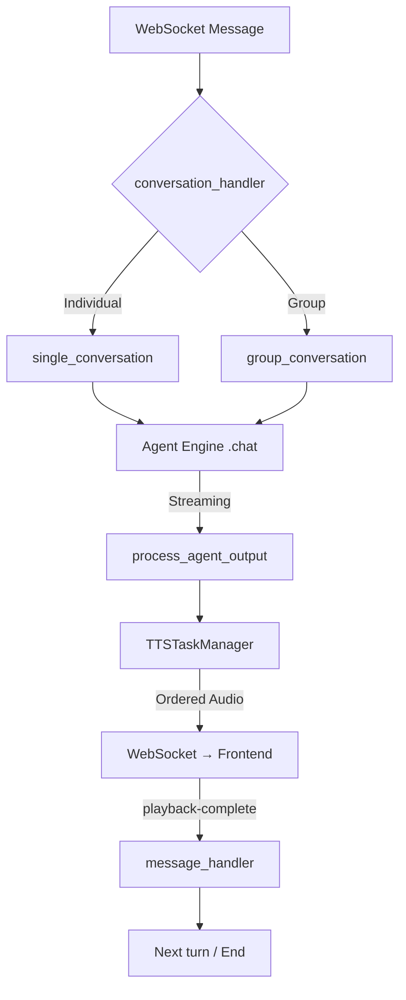

# Conversation Turn System — Implementation Guide for AI Agents

> **Audience**: Another AI agent tasked with building a real-time, asynchronous conversation turn system in a new project.
> **Reference implementation**: The MIA project (`src/MIA/conversations/`).

---

## 1. System Overview

This system controls **who speaks when** in a real-time AI assistant that communicates via WebSockets with a browser frontend. It supports:

- **Single-user conversations** (human ↔ AI)
- **Group conversations** (human ↔ multiple AIs taking turns)
- **Interruptions** (user can cut off an AI mid-response)
- **Proactive speech** (AI can initiate without user input)
- **Streaming responses** with parallel TTS generation
- **Frontend-backend synchronization** (backend waits for audio playback to finish)



---

## 2. Architecture — File by File

You need to create the following modules. Each section explains its **purpose**, **key data structures**, and **exact behavior**.

### 2.1 `types.py` — Shared Type Definitions

```python
from typing import List, Dict, Callable, Optional, TypedDict, Awaitable, ClassVar
from dataclasses import dataclass, field

# Type aliases for WebSocket communication
WebSocketSend = Callable[[str], Awaitable[None]]
BroadcastFunc = Callable[[List[str], dict, Optional[str]], Awaitable[None]]


@dataclass
class BroadcastContext:
    """Carries broadcast info so utility functions can relay messages to group."""
    broadcast_func: Optional[BroadcastFunc] = None
    group_members: Optional[List[str]] = None
    current_client_uid: Optional[str] = None


@dataclass
class GroupConversationState:
    """
    Mutable state object for a group conversation. Registered in a class-level
    dict so interrupt handlers can look it up by group_id.
    """
    _states: ClassVar[Dict[str, "GroupConversationState"]] = {}

    group_id: str
    conversation_history: List[str] = field(default_factory=list)
    memory_index: Dict[str, int] = field(default_factory=dict)
    group_queue: List[str] = field(default_factory=list)
    session_emoji: str = ""
    current_speaker_uid: Optional[str] = None

    def __post_init__(self):
        GroupConversationState._states[self.group_id] = self

    @classmethod
    def get_state(cls, group_id: str):
        return cls._states.get(group_id)

    @classmethod
    def remove_state(cls, group_id: str):
        cls._states.pop(group_id, None)
```

**Key design decisions**:
- `_states` is a **class variable** (singleton registry). This lets interrupt handlers find the active group state without passing it through every function.
- `group_queue` is a **list used as a round-robin queue**: pop from front, append after turn completes.
- `memory_index` tracks **per-member read position** into `conversation_history`, so each AI only receives messages it hasn't seen yet.

---

### 2.2 `message_handler.py` — Frontend-Backend Synchronization

This is the **most critical component for turn correctness**. It implements a request-response pattern over WebSockets using `asyncio.Event`.

```python
class MessageHandler:
    def __init__(self):
        # Key: client_uid → Dict[(response_type, request_id) → Event]
        self._response_events = defaultdict(dict)
        self._response_data = defaultdict(dict)

    async def wait_for_response(self, client_uid, response_type,
                                 request_id=None, timeout=None):
        event = asyncio.Event()
        key = (response_type, request_id)
        self._response_events[client_uid][key] = event
        try:
            if timeout:
                await asyncio.wait_for(event.wait(), timeout)
            else:
                await event.wait()
            return self._response_data[client_uid].pop(key, None)
        except asyncio.TimeoutError:
            return None
        finally:
            self._response_events[client_uid].pop(key, None)

    def handle_message(self, client_uid, message):
        msg_type = message.get("type")
        request_id = message.get("request_id")
        key = (msg_type, request_id)
        if client_uid in self._response_events and key in self._response_events[client_uid]:
            self._response_data[client_uid][key] = message
            self._response_events[client_uid][key].set()

    def cleanup_client(self, client_uid):
        if client_uid in self._response_events:
            for event in self._response_events[client_uid].values():
                event.set()  # Unblock any waiters
            self._response_events.pop(client_uid)
            self._response_data.pop(client_uid, None)

# Singleton — import this instance everywhere
message_handler = MessageHandler()
```

**Why this matters**: After the backend sends all audio chunks, it calls:
```python
await message_handler.wait_for_response(client_uid, "frontend-playback-complete")
```
This **blocks the backend turn** until the frontend confirms it has finished playing all audio. Without this, in group conversations, the next AI would start talking before the current one finishes.

**Frontend contract**: The frontend must send `{"type": "frontend-playback-complete"}` after its audio queue is drained.

---

### 2.3 `tts_manager.py` — Ordered Parallel TTS

The LLM streams sentences one at a time, but TTS generation is slow. The solution: **generate TTS in parallel, but send results to the frontend in order**.

```
LLM Stream: Sentence1 → Sentence2 → Sentence3
                ↓            ↓            ↓
TTS Tasks:   Task(seq=0)  Task(seq=1)  Task(seq=2)   ← parallel
                ↓            ↓            ↓
Payload Queue: (payload, 0) (payload, 2) (payload, 1) ← arrive out of order
                              ↓
Sender Task:  Sends seq=0, buffers seq=2, waits for seq=1, then sends 1, then 2
```

**Implementation**:
```python
class TTSTaskManager:
    def __init__(self):
        self.task_list: List[asyncio.Task] = []
        self._payload_queue: asyncio.Queue = asyncio.Queue()
        self._sender_task: Optional[asyncio.Task] = None
        self._sequence_counter = 0
        self._next_sequence_to_send = 0

    async def speak(self, tts_text, display_text, actions, ...):
        current_sequence = self._sequence_counter
        self._sequence_counter += 1

        # Start sender loop if not running
        if not self._sender_task or self._sender_task.done():
            self._sender_task = asyncio.create_task(
                self._process_payload_queue(websocket_send)
            )

        # Fire TTS generation in background
        task = asyncio.create_task(
            self._process_tts(..., sequence_number=current_sequence)
        )
        self.task_list.append(task)

    async def _process_payload_queue(self, websocket_send):
        buffered = {}
        while True:
            payload, seq = await self._payload_queue.get()
            buffered[seq] = payload
            # Send in order
            while self._next_sequence_to_send in buffered:
                await websocket_send(json.dumps(
                    buffered.pop(self._next_sequence_to_send)
                ))
                self._next_sequence_to_send += 1
            self._payload_queue.task_done()

    async def _process_tts(self, tts_text, ..., sequence_number):
        audio_path = await tts_engine.async_generate_audio(tts_text, ...)
        payload = prepare_audio_payload(audio_path, display_text, actions)
        await self._payload_queue.put((payload, sequence_number))

    def clear(self):
        self.task_list.clear()
        if self._sender_task:
            self._sender_task.cancel()
        self._sequence_counter = 0
        self._next_sequence_to_send = 0
        self._payload_queue = asyncio.Queue()
```

**Why this works so well**:
1. TTS for sentence 3 can start generating **before** sentence 2 finishes.
2. The sender loop **buffers out-of-order completions** and only sends when the next expected sequence number is available.
3. The frontend receives audio in the **correct sentence order**, every time.

---

### 2.4 `conversation_handler.py` — The Orchestrator

This is the entry point. It receives WebSocket messages and decides what to do.

**Core responsibilities**:
1. Determine the trigger type: `text-input`, `mic-audio-end`, or `ai-speak-signal` (proactive).
2. Check if a conversation is already running for this client/group → prevent overlapping turns.
3. Dispatch to `single_conversation` or `group_conversation` as an `asyncio.Task`.
4. Handle interruptions (cancel running tasks).

```python
async def handle_conversation_trigger(msg_type, data, client_uid, context, ...):
    # 1. Determine user_input
    if msg_type == "ai-speak-signal":
        user_input = "Please say something."
        metadata = {"proactive_speak": True, "skip_memory": True, "skip_history": True}
    elif msg_type == "text-input":
        user_input = data.get("text", "")
    else:  # mic-audio-end
        user_input = received_data_buffers[client_uid]  # numpy array
        received_data_buffers[client_uid] = np.array([])

    # 2. Check group membership and dispatch
    group = chat_group_manager.get_client_group(client_uid)
    if group and len(group.members) > 1:
        task_key = group.group_id
        if task_key not in tasks or tasks[task_key].done():
            tasks[task_key] = asyncio.create_task(
                process_group_conversation(...)
            )
    else:
        tasks[client_uid] = asyncio.create_task(
            process_single_conversation(...)
        )
```

**Concurrency guard**: The `if task_key not in tasks or tasks[task_key].done()` check prevents starting a new conversation while one is in progress. This is the **primary turn-locking mechanism**.

---

### 2.5 `single_conversation.py` — One Human, One AI

A single turn works like this:

```
1. Send "conversation-chain-start" signal      → frontend shows thinking indicator
2. Send "Thinking..." text                     → frontend displays placeholder
3. Process user input (ASR if audio)           → get text
4. Create BatchInput                           → structured input for agent
5. Store user message in history               → persistence
6. Call agent_engine.chat(batch_input)          → returns async generator
7. For each output in stream:
     - If SentenceOutput/AudioOutput → process_agent_output → TTS → send audio
     - If tool_call_status dict      → forward to frontend (show tool usage)
8. await asyncio.gather(*tts_manager.task_list) → wait for all TTS to finish
9. Send "backend-synth-complete"                → tell frontend: no more audio coming
10. await message_handler.wait_for_response(    → BLOCK until frontend says playback done
        client_uid, "frontend-playback-complete")
11. Send "force-new-message"                    → frontend starts fresh message bubble
12. Send "conversation-chain-end"               → frontend removes thinking indicator
13. Store AI response in history                → persistence
14. Cleanup TTS resources                       → always, even on error
```

**Error handling pattern**:
```python
try:
    # ... main conversation logic ...
except asyncio.CancelledError:
    # User interrupted — re-raise to let asyncio handle cancellation
    raise
except Exception as e:
    # Send error to frontend, then re-raise
    await websocket_send(json.dumps({"type": "error", "message": str(e)}))
    raise
finally:
    cleanup_conversation(tts_manager, session_emoji)  # ALWAYS clean up
```

---

### 2.6 `group_conversation.py` — Multiple AIs Taking Turns

This is where the turn system gets interesting. The pattern is a **round-robin queue with shared conversation history and per-member read cursors**.

#### Initialization
```python
state = GroupConversationState(
    group_id=f"group_{initiator_uid}",
    group_queue=list(group_members),        # [AI_A, AI_B, AI_C]
    memory_index={uid: 0 for uid in group_members},  # all start at 0
)
state.conversation_history = [f"{human_name}: {input_text}"]
```

#### Main Loop
```python
while state.group_queue:
    current_member_uid = state.group_queue.pop(0)  # Take next AI
    state.current_speaker_uid = current_member_uid

    # Get only NEW messages this AI hasn't seen
    new_messages = state.conversation_history[state.memory_index[current_member_uid]:]
    new_context = "\n".join(new_messages)

    # AI generates response
    full_response = await process_member_response(context, batch_input, ...)

    # Wait for TTS + frontend playback
    await asyncio.gather(*tts_manager.task_list)
    await finalize_conversation_turn(...)

    # Update shared state
    state.conversation_history.append(f"{ai_name}: {full_response}")
    state.memory_index[current_member_uid] = len(state.conversation_history)
    state.group_queue.append(current_member_uid)  # Re-enqueue for next round

    state.current_speaker_uid = None
```

**Why this works**:
- Each AI only sees messages **since its last turn** (`memory_index`), preventing context pollution.
- The queue is circular (pop front, append back), creating natural round-robin turns.
- `current_speaker_uid` is tracked so interrupt handlers know **who** was speaking.
- The `finalize_conversation_turn` call **blocks until the current AI's audio finishes playing**, so AIs never overlap.

#### Group Interruption
```python
async def handle_group_interrupt(group_id, heard_response, ...):
    state = GroupConversationState.get_state(group_id)
    current_speaker_uid = state.current_speaker_uid  # Save before cancel

    task.cancel()       # Cancel the running conversation
    await task          # Wait for CancelledError to propagate

    # Clean up each member's agent state
    for member_uid in group.members:
        member_ctx.agent_engine.handle_interrupt(heard_response)
        store_message(role="ai", content=heard_response)    # partial response
        store_message(role="system", content="[Interrupted by user]")

    GroupConversationState.remove_state(group_id)

    # Tell all clients about the interruption
    await broadcast_to_group(group.members, {"type": "interrupt-signal"})
```

---

### 2.7 `conversation_utils.py` — Shared Utilities

These are stateless helper functions used by both single and group conversations:

| Function | Purpose |
|---|---|
| `create_batch_input()` | Wraps text + images + metadata into the `BatchInput` dataclass |
| `process_user_input()` | If input is `numpy.ndarray`, run ASR to get text; otherwise return as-is |
| `process_agent_output()` | Routes `SentenceOutput` → TTS pipeline, `AudioOutput` → direct send |
| `send_conversation_start_signals()` | Sends `conversation-chain-start` + `Thinking...` |
| `finalize_conversation_turn()` | Waits for TTS, waits for frontend playback, sends `force-new-message` + `conversation-chain-end` |
| `cleanup_conversation()` | Clears TTS manager resources |

---

## 3. WebSocket Protocol

The frontend and backend communicate with JSON messages over WebSockets. Here is the full protocol:

### Backend → Frontend

| `type` | Meaning | When |
|---|---|---|
| `control` + `conversation-chain-start` | AI is thinking | Turn begins |
| `full-text` + `Thinking...` | Placeholder text | During LLM inference |
| `user-input-transcription` | ASR result | After transcribing audio |
| `audio-response` | Audio chunk + display text + actions | Per sentence from TTS |
| `backend-synth-complete` | All TTS done for this turn | After last audio chunk |
| `force-new-message` | Start new message bubble | After playback confirmed |
| `control` + `conversation-chain-end` | Turn complete | End of turn |
| `tool_call_status` | Agent is calling a tool | During agent processing |
| `interrupt-signal` | Conversation was interrupted | On user interrupt |
| `error` | Error occurred | On failure |

### Frontend → Backend

| `type` | Meaning | When |
|---|---|---|
| `text-input` | User typed text | User submits text |
| `mic-audio-end` | User finished speaking | After VAD silence detection |
| `ai-speak-signal` | Trigger proactive speech | Timer/button in frontend |
| `frontend-playback-complete` | Audio playback finished | After all audio chunks played |
| `interrupt` | User wants to interrupt | User clicks stop/speaks again |

---

## 4. Critical Implementation Notes

### 4.1 Concurrency Model

- **One conversation per client/group at a time.** Enforced by checking `task.done()` before creating a new task.
- **All conversation processing runs inside `asyncio.create_task()`**, so the WebSocket listener remains responsive.
- **TTS generation is parallelized**, but delivery is serialized via sequence numbers.
- **Frontend synchronization is blocking**: `wait_for_response` uses `asyncio.Event.wait()`, which yields the event loop without blocking other coroutines.

### 4.2 State Cleanup

Every path (success, error, cancellation) must clean up:
```python
try:
    # ... conversation logic ...
except asyncio.CancelledError:
    raise  # Let asyncio handle it, but finally block still runs
except Exception:
    raise
finally:
    cleanup_conversation(tts_manager, session_emoji)
    # For groups: GroupConversationState.remove_state(group_id)
```

### 4.3 Interruption Safety

When an interrupt arrives:
1. The running `asyncio.Task` is `.cancel()`ed.
2. The agent engine's `handle_interrupt(heard_response)` is called with whatever partial response was generated.
3. The partial response and an `[Interrupted by user]` marker are stored in history.
4. TTS resources are cleaned up in the `finally` block.

### 4.4 Proactive Speech

The `metadata` dict carries flags like `skip_memory` and `skip_history` to prevent proactive prompts from polluting the conversation history. This is essential — without it, the AI's automatic check-in messages would accumulate in memory and confuse the LLM.

### 4.5 Group Context Windowing

Each AI in a group only receives **new messages since its last turn**:
```python
new_messages = state.conversation_history[state.memory_index[member_uid]:]
```
This prevents sending the entire conversation each time, keeping prompts short and focused.

---

## 5. Step-by-Step Implementation Checklist

When building this system in a new project, implement in this order:

### Phase 1: Foundation
- [ ] Define `WebSocketSend` and `BroadcastFunc` type aliases
- [ ] Implement `MessageHandler` singleton with `wait_for_response` / `handle_message`
- [ ] Define agent input types (`BatchInput`, `TextData`, etc.)
- [ ] Define agent output types (`SentenceOutput`, `AudioOutput`, `DisplayText`, `Actions`)
- [ ] Ensure your agent engine's `.chat()` method returns an `AsyncGenerator` yielding these output types

### Phase 2: TTS Pipeline
- [ ] Implement `TTSTaskManager` with sequence-numbered parallel generation
- [ ] Implement `_process_payload_queue` sender loop with buffered reordering
- [ ] Implement `prepare_audio_payload` to create the JSON structure for audio chunks
- [ ] Test: Fire 5 TTS tasks with artificial delays; verify they arrive in order

### Phase 3: Single Conversation
- [ ] Implement `process_single_conversation` with the full 14-step flow
- [ ] Implement all `conversation_utils` helper functions
- [ ] Wire `finalize_conversation_turn` to block on `frontend-playback-complete`
- [ ] Implement the frontend contract: send `frontend-playback-complete` after audio queue drains
- [ ] Test: One full conversation round-trip with TTS and playback sync

### Phase 4: Conversation Handler
- [ ] Implement `handle_conversation_trigger` with concurrency guard
- [ ] Implement `handle_individual_interrupt` with task cancellation + history storage
- [ ] Test: Send text while AI is responding → verify interrupt works cleanly

### Phase 5: Group Conversations
- [ ] Implement `GroupConversationState` with class-level registry
- [ ] Implement `process_group_conversation` with the round-robin queue
- [ ] Implement `handle_group_member_turn` with memory windowing
- [ ] Implement `handle_group_interrupt` with broadcast cleanup
- [ ] Test: 3 AIs taking turns; interrupt mid-response; verify state cleanup

### Phase 6: Proactive Speech
- [ ] Add metadata flags (`proactive_speak`, `skip_memory`, `skip_history`)
- [ ] Wire `ai-speak-signal` message type in conversation handler
- [ ] Test: Proactive messages don't appear in persistent history

---

## 6. Common Pitfalls

| Pitfall | Solution |
|---|---|
| Audio chunks arrive out of order | The `TTSTaskManager` sequence numbering + buffer pattern |
| AIs talk over each other in groups | `wait_for_response("frontend-playback-complete")` blocks until done |
| Two conversations start simultaneously | `task.done()` guard in `handle_conversation_trigger` |
| Interrupted conversations leave zombie state | Always clean up in `finally` blocks |
| Proactive messages pollute context | `metadata.skip_memory` + `metadata.skip_history` flags |
| Group AI sees stale context | `memory_index` per member tracks read position |
| Frontend hangs waiting for backend | `cleanup_client()` in `MessageHandler` sets all events on disconnect |
| TTS files accumulate on disk | `tts_engine.remove_file()` in `_process_tts` finally block |

---

## 7. Minimal Viable Example

If you want to test the turn system without a full pipeline, here's a skeleton:

```python
import asyncio
import json

# Simulate an agent that streams sentences
async def fake_agent_chat(input_text):
    sentences = [f"Response part {i} to: {input_text}" for i in range(3)]
    for s in sentences:
        await asyncio.sleep(0.5)  # Simulate LLM latency
        yield SentenceOutput(
            display_text=DisplayText(text=s),
            tts_text=s,
            actions=Actions()
        )

# Simulate a WebSocket
class FakeWebSocket:
    async def send_text(self, msg):
        data = json.loads(msg)
        print(f"  → Frontend: {data.get('type', 'audio')}: "
              f"{data.get('text', data.get('display_text', {}).get('text', ''))}")

# Simulate frontend playback confirmation
async def simulate_frontend_playback(handler, client_uid, delay=1.0):
    await asyncio.sleep(delay)
    handler.handle_message(client_uid, {"type": "frontend-playback-complete"})

# Run a single conversation turn
async def main():
    ws = FakeWebSocket()
    handler = MessageHandler()
    client_uid = "test-client"

    # Start playback confirmation in background
    asyncio.create_task(simulate_frontend_playback(handler, client_uid))

    await process_single_conversation(
        context=...,  # Your service context
        websocket_send=ws.send_text,
        client_uid=client_uid,
        user_input="Hello!",
    )
    print("Turn complete!")

asyncio.run(main())
```

---

## 8. Summary of Why This Design Works Well

1. **Async without blocking**: `asyncio.create_task` keeps the WebSocket listener free while conversations process in the background.
2. **Ordered parallel TTS**: Sequence numbers + buffer pattern gives both speed (parallel generation) and correctness (ordered delivery).
3. **Frontend sync gate**: `wait_for_response("frontend-playback-complete")` is the linchpin — it prevents turn overlap without polling or timers.
4. **Clean state management**: `GroupConversationState` with class-level registry makes state accessible to interrupt handlers without threading it through every function.
5. **Memory windowing**: Per-member `memory_index` keeps AI context fresh and minimal.
6. **Robust cleanup**: `try/except/finally` at every level ensures resources are freed regardless of how a conversation ends.

This design prioritizes **perceived responsiveness** (streaming + parallel TTS) while maintaining **strict turn ordering** (sequence numbers + playback gates). The result is a system that feels fast and natural to the end user.
